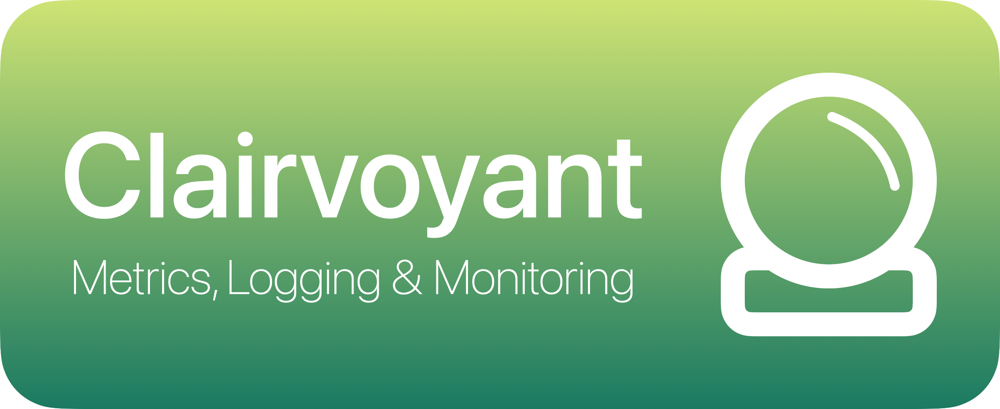

<p align="center">
    
</p>

Clairvoyant is a framework to provide monitoring data for Swift servers, targeted at [Vapor](https://vapor.codes). 
It enables the specification of different metrics to publish over a web API, where it can be collected by monitoring instances.

The framework can also be used as a logging backend for [swift-log](https://github.com/apple/swift-log), so that log contents can be made available conveniently over a web api (see [logging backend](#usage-with-swift-log)).

## Intention

This framework intends to provide a very lightweight logging and monitoring possibility, especially for Vapor servers. 
It allows publishing, collecting, and logging time-series data in a very simple way.
The goal is to provide easy remote access to basic information about running services, as well as provide history data.

It is maybe similiar to approaches like [swift-metrics](https://github.com/apple/swift-metrics), but without running a cumbersome monitoring backend, and with a bit more flexibility.

### Modules

This package consists of several modules, which separate the logic according to the needed functions.

| Module | Content |
| --- | --- |
| Clairvoyant | The main module with metrics and consumers |
| ClairvoyantVapor | Extensions to expose metrics through a [Vapor](https://vapor.codes) server |
| ClairvoyantLogging | Use a metrics observer as a backend for [swift-log](https://github.com/apple/swift-log) |
| ClairvoyantMetrics | Use a metrics observer as a backend for [swift-metrics](https://github.com/apple/swift-metrics) |
| ClairvoyantCBOR | Extensions to use [CBOR](https://cbor.io) encoding for metrics |

The individual modules are explained in more detail below.

## Usage

Clairvoyant is structured around the concept of `metrics`, which are monitored by `observers`. 
A metric describes a basic data point over time, such as integers, doubles, enums, or other data types. 
A metric collects any changes to the data point, logs it to disk, and optionally forwards the data to a remote server.
Metrics are identified by a unique identifier string.

```swift
import Clairvoyant
```

### Metrics

Let's first create a metric before discussing logging and access control.
Metrics are written as Swift `Actor`s, so they are thread-safe, but require an asynchronous context.

```swift
let metric: Metric<Int> = try await Metric("myMetric")
```

Once a metric is created, it can be updated with new values:

```swift
try await metric.update(123)
```

The call to `update()` creates a timestamp for the given value, and persists this pair. 
Internally, metrics are only updated when the value changes, so calling `update()` multiple times with the same value does not unnecessarily increase the size of the log file.
Datapoints older than the last value are also ignored (only applicable when setting custom timestamps).

It's also possible to get the last value or a history for each metric.

```swift
let last: Timestamped<Int>? = await metric.lastValue()
```

The `Timestamped<T>` struct wraps a value with a timestamp to create a point in a time series.
That makes it possible to order values chronologically, and to obtain values within a specific interval.

```swift
let range = Date().addintTimeInterval(-100)...Date() // last 100 seconds
let lastValues: [Timestamped<Int>] = try await metric.getHistory(in: range)
```

These functions represent the basic interaction with a metric on the creator side.

### Metric observer

A `Metric` requires a `MetricObserver` to receive the data and process it.
The observer is responsible for managing different metrics, and provide a common storage location.
To create an observer, we have to provide a directory where the logging data can be written.
It also internally writes all errors to a `Metric<String>` with the `id` provided by the parameter `logMetricId`.

```swift
let url: URL = ...
let observer = MetricObserver(logFolder: url, logMetricId: "test.log")
```

The logging metric can later be read in the same way as other metrics.
It's also possible to add additional log entries.

```swift
await observer.log("Something happened")
```

The observer is now ready to handle metrics, so the previously created metric can be added to it.

```swift
observer.observe(metric)
```

It's also possible to directly create metrics on the observer:
```swift
let metric: Metric<Int> = observer.addMetric("MyCounter")
```

There is a static property on `MetricObserver` to add metrics to by default:

```swift
MetricObserver.standard = observer
let metric = Metric("metric", containing: Int.self) // Automatically added to `observer`
```

## Exposing metrics with Vapor

Logging values to disk is great, but the data should also be available for inspection and monitoring.
Clairvoyant provides a separate module `ClairvoyantVapor` to integrate metric access into Vapor servers.
Each `MetricObserver` can be exposed separately on a subpath of the server.

```swift
import Clairvoyant
import ClairvoyantVapor

func configure(app: Application) {
    let observer = MetricObserver(...)
    let provider = VaporMetricProvider(observer: observer, accessManager: MyAuthenticator())
    observer.registerRoutes(app)
}
```

This will add a number of routes to the default path, which is `/metrics`.
The path can also be passed as a parameter to `registerRoutes()`.

### Access control

A `VaporMetricProvider` requires an access manager, as seen in the example above.
Since the metrics may contain sensitive data, they should only be accessible by authorized entities.
Access control is left to the application, since there may be many ways to handle authentication and access control.
To manage access control, a `MetricRequestAccessManager` must be provided for each metric provider.

```swift
final class MyAuthenticator: MetricRequestAccessManager {

    func metricListAccess(isAllowedForRequest request: Request) throws {
        throw MetricError.accessDenied
    }

    func metricAccess(to metric: MetricId, isAllowedForRequest request: Request) throws {
        throw MetricError.accessDenied
    }
}
```

The authenticator must be provided to the initializer of a `VaporMetricProvider`.

```swift
let provider = VaporMetricProvider(observer: observer, accessManager: MyAuthenticator())
```

If the authentication should be based on access tokens, it's also possible to implement `MetricAccessManager`.

```swift
final class MyAuthenticator: MetricAccessManager {
    
    func metricListAccess(isAllowedForToken accessToken: Data) throws {
        throw MetricError.accessDenied
    }

    func metricAccess(to metric: MetricId, isAllowedForToken accessToken: Data) throws {
        throw MetricError.accessDenied
    }
}
```

Or, if very basic authentication should be used, by using the provided in-memory stub:
```swift
let accessToken: Set<AccessToken> = ...
let authenticator = AccessTokenManager(accessToken)
let provider = VaporMetricProvider(observer: observer, accessManager: authenticator)
```

### API

Now that the metrics are protected, they can be accessed by authorized entities. 
There are currently four main entry points. 
All requests are `POST` requests, and require authentication. 
**Note**: If the included clients are used, then the API is already correctly implemented and not important. 

#### `/list`

Lists the metrics currently published by the observer.
The request calls the function `metricListAccess(isAllowedForRequest:)` or `metricListAccess(isAllowedForToken:)`, whichever is implemented.

The response is an array of `MetricDescription`, encoded with the binary encoder assigned to the `MetricObserver`.

#### `/last/<METRIC_ID_HASH>`

Get the last value of the metric. The `<METRIC_ID_HASH>` are the first 16 bytes of the SHA256 hash of the metric `ID` as a hex string (32 characters). Authentication of the `POST` request depends on the chosen implementation.
The response is a `Timestamped<T>` with the last value of the metric, encoded with the supplied binary encoder. If no value exists yet, then status `410` is returned.

#### `/history/<METRIC_ID_HASH>`

Get the logged values of a metric in a specified time interval. 
The time interval is provided in the `POST` request body as a binary encoding of a `MetricHistoryRequest` containing the start and end dates of the interval, and a maximum count of elements to return.
The request can be performed chronologically (start < end) or reversed (end > start).
Authentication of the request depends on the chosen implementation.
The response is a `[Timestamped<T>]` with the values in the provided range (up to the given limit).

#### `/push/<METRIC_ID_HASH>`

Add values to a metric through the web interface. This function is mostly needed to push metrics to other vapor servers.
Updating a metric is only allowed if `canBeUpdatedByRemote` is set to `true` when the metric is created.
The request body of the `POST` request contains a `[Timestamped<T>]` encoded as binary data.

### Pushing to other servers

Metrics can be configured to automatically transmit the logged values to a remote server for monitoring or persistence.
To configure this feature, one or more `RemoteMetricObserver`s can be added to each metric.
Whenever a new value is set, then the metric attempts to send all pending updates (including any previously failed values) to the remote observer using the `push` route specified above.

The remote server must have a metric with the same `id` registered with the observer, and the metric must be configured with `canBeUpdatedByRemote = true`.

### Receiving from other servers

To receive a metric pushed from a remote server, configure a metric with `canBeUpdatedByRemote = true`. Any time a new value is received the metric will be updated with this value.
The last value as well as history data can be accessed as with any other metric.

### Complex types

**To Be Documented**

## Usage with `swift-log`

Clairvoyant can be used as a logging backend for `swift-log`, so that all logs are made available as `String` metrics.
To forward logs as metrics, first import the required module:

```swift
import Clairvoyant
import ClairvoyantLogging
```

Now, simply set an observer as the backend:

```swift
let observer = MetricObserver(...)
let logging = MetricsLogging(observer: observer)
LoggingSystem.bootstrap(logging.backend)
```

Each logging entry will then be timestamped and added to a metric with the same `ID` as the logger `label`.

```swift
let logger = Logger(label: "my.log")
logger.info("It works!")
```

The logging metrics are made available over the API in the same way as other metrics, and can also be accessed directly.

```swift
let metric = observer.getMetric(id: "my.log", type: String.self)
```

It's possible to change the logging format by setting the `loggingFormat` property on `MetricLogging` before creating a logger.
The property applies to each new logger, but changes are not propagated to existing ones.

```swift
logging.outputFormat = .full
```

## Usage with `swift-metrics`

Clairvoyant can be used as a metrics backend for [`swift-metrics`](https://github.com/apple/swift-metrics), to store metrics and serve them over a web api.
Each `Counter`, `Recorder`, `Gauge` or `Timer` is forwarded to a metric with the same `label` (`id`). While counters become `Metric<Int>`, all others become `Metric<Double>` (be aware of the unaccuracy of `Double` when using `Recorder.record(Int64)`).

To use a `MetricObserver` as a metrics backend, first import the module:

```swift
import Clairvoyant
import ClairvoyantMetrics
```

Then set the observer as the metrics backend:

```swift
let observer = MetricObserver(...)
let metrics = MetricsProvider(observer: observer)
MetricsSystem.bootstrap(metrics)
```

Now the metrics can be used, and are available through the web API or locally.

```swift
let counter = Counter(label: "com.example.BestExampleApp.numberOfRequests")
counter.increment()
```

To access the values locally:

```swift
let metric = observer.getMetric(id: "...", type: String.self)
let lastValue = await metric.lastValue()
```

## Initial requirements

**Allow publishing of individual metrics** *Implemented*

Different metrics can be created, updated, and exposed through a Vapor server.

**Allow different data types: Int, Bool, Double, Enum, and complex objects** *Implemented*

Any Swift type can be used as a metric, as long as it conforms to `MetricValue`. 
Some standard types have been implemented: `Int`, `Double`, `Bool`, `Enum(UInt8)`, and `ServerStatus`.

**Use efficient binary encoding** *Implemented*

Any binary encoder can be specified for encoding and decoding, as long as it conforms to `BinaryEncoder` and `BinaryDecoder`.
Timestamps (aka `Double`) must be encoded with a fixed length for the encoding to work.
Extensions are provided for `CBOR` encoding through `ClairvoyantCBOR`.

**Specify read and write access for each property** *Implemented*

Access control is left to the application, and can be performed individually for each request.
Some convenience functions are provided to simplify access control through tokens.

**Protect information through access control** *Implemented*

See above.

**Allow logging of changed values to disk** *Implemented*

Values are timestamped and written to log files on disk. 
Log files are split according to a configurable maximum size.

**Allow access to current value and optionally all past values** *Implemented*

Metrics provide `lastValue()` and `getHistory()` functions to access stored values.
These can also be accessed through the Vapor web interface.

**Collect metrics from different sources: Variables, log files, online requests, etc.** *Not implemented*

Feeding metric with values is left to the application.
Additional features may be implemented in time to observe and process log files or perform automatic requests.
 
**Provide information about the retrievable parameters** *Implemented*

`MetricObservers` provide a list of the metrics with basic information (name, description, type) about them.

**General logging of errors** *Implemented*

Each `MetricObserver` has a metric dedicated to logging of internal errors

**Push changed values to different server** *Implemented*

Metrics can be configured with remote observers, were new values are automatically transmitted to.

## Open tasks

- Persist pending values to remote observers between launches
- Add function to delete old values from logs
- Add total file size limit to metric (automatically delete oldest files)
- Provide values as strings/JSON for web view
- Add convenience features to observe log files or perform periodic network requests.
